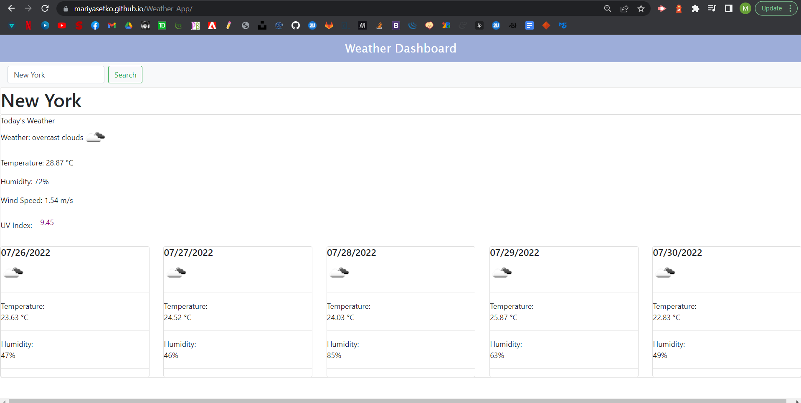

# Weather Dashboard

## Description

Using the OpenWeather third party API, this application retrieves current weather data for a given city. Users will type their chosen city in the input field and hit the "Search" button. Today's information will populate the Weather, an icon, Temperature, Humidity, Wind Speed, and UV Index (including colour indicators for different levels of severity).

The other five days below will display Date, an icon, Temperature, and Humidity.

## User Story

```
AS A traveler
I WANT to see the weather outlook for multiple cities
SO THAT I can plan a trip accordingly
```

## Screenshot


## GitHub Pages

https://mariyasetko.github.io/Weather-App/
